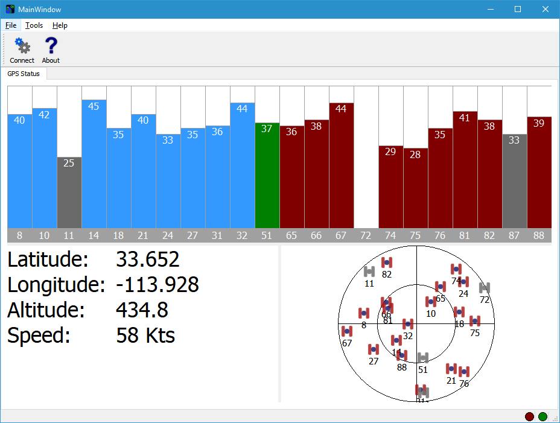

# NMEA Parser Class Library
Monte Variakojis \@VisualGPS

The NMEA 0813 standard for interfacing marine electronics devices specifies the NMEA data sentence structure as well as general definitions of approved sentences. However, the specification does not cover implementation and design. This source here describes parsing the packet and a handful of individual NMEA sentences. Another challenge is multimode GPS receivers.

The NMEA standard does not specify the use when a vendor uses a receiver that can handle multiple constellations. The NMEAParser does it's best to deal with this.

## Documentation
https://visualgps.github.io/NMEAParser/

## Features

  - Multi-platform - Tested on Linux, Windows and MacOS
  - No outside library dependencies.
  - OS independent (no OS specific calls)
  - Abstract software synchronization. You can redefine the data lock virtual method to support your OS
    specific semaphore or mutex functions.
  - NMEA sentence notification. Redefine methods to get notified that a new NMEA sentence was
    processed.
  - Bonus Qt project ~~included~~ to show the NMEAParser in action. Supports Windows, Linux and Mac OS. **NOTE: This project has been moved into its own repo located at:** https://github.com/VisualGPS/VisualGPSqt
    

## Required and Optional Tools
  - cmake - Build environment. See https://cmake.org
  - C++ 11 complaint compiler (Linux gcc or MS Windows VisualStudio)
  - doxygen (for documentation, optional but recommended) - http://www.stack.nl/~dimitri/doxygen/
  - graphviz (for documentation, optional but recommended) - http://graphviz.org/
  - Qt 5.8 (optional) - https://www.qt.io/ Qt is a cross platform graphical interface tool that will allow you to build comprehensive GUI application.  The source code also includes a Qt project that uses the NMEAParser, displays position status, satellite azimuth/elevation, and signal quality graphically.

## Build

  - Linux:
	```
	   $ mkdir ./NMEAParserBuild
	   $ cd NMEAParserBuild
	   $ cmake ../Software
	   $ make
	   $ make doc
	```
  - Windows:
	```
	   [code was cloned to c:\Source\NMEAParser]
       c:\Source\NMEAParser>mkdir ./NMEAParserBuild
       c:\Source\NMEAParser>cd NMEAParserBuild
       c:\Source\NMEAParser\NMEAParserBuild>cmake ../Software
	   [Run VisualStudio and build as normal]
	```

- Qt project VisualGPSqt -- Use Qt creator to load and compile the project. For Windows, the project assumed the MinGW version of Qt.

## Usage

Below is a basic program that defines a CNMEAParser object and streams NMEA data from a text
file.

```cpp
	#include <stdio.h>
	#include <NMEAParser.h>

	///
	/// \class MyParser
	/// \brief child class of CNMEAParser which will redefine notification calls from the parent class.
	///
	class MyNMEAParser : public CNMEAParser {

		///
		/// \brief This method is called whenever there is a parsing error.
		///
		/// Redefine this method to capture errors.
		///
		/// \param pCmd Pointer to NMEA command that caused the error. Please note that this
		/// parameter may be NULL of not completely defined. Use with caution.
		///
		virtual void OnError(CNMEAParserData::ERROR_E nError, char *pCmd) {
			printf("ERROR for Cmd: %s, Number: %d\n", pCmd, nError);
		}

	protected:
		///
		/// \brief This method is redefined from CNMEAParserPacket::ProcessRxCommand(char *pCmd, char *pData)
		///
		/// \param pCmd Pointer to the NMEA command string
		/// \param pData Comma separated data that belongs to the command
		/// \return Returns CNMEAParserData::ERROR_OK If successful
		///
		virtual CNMEAParserData::ERROR_E ProcessRxCommand(char *pCmd, char *pData) {

			// Call base class to process the command
			CNMEAParser::ProcessRxCommand(pCmd, pData);

			printf("Cmd: %s\nData: %s\n", pCmd, pData);
			return CNMEAParserData::ERROR_OK;
		}
	};

	int main(int argc, char *argv[], char *envp[]) {

		FILE *fp;
		MyNMEAParser	NMEAParser;

		//
		// Make sure that we have enough parameters
		//
		if (argc < 2) {
			printf("Usage: NMEAParserTest [file]\n");
			return -1;
		}

		//
		// Open the NMEA file, fail if cannot open
		//
		fp = fopen(argv[1], "r");
		if (fp == NULL) {
			printf("Could not open file: %s\n", argv[1]);
			return -1;
		}

		//
		// Read the file and process
		//
		char pBuff[1024];
		while (feof(fp) == 0) {
			size_t nBytesRead = fread(pBuff, 1, 512, fp);

			CNMEAParserData::ERROR_E nErr;
			if ((nErr = NMEAParser.ProcessNMEABuffer(pBuff, nBytesRead)) != CNMEAParserData::ERROR_OK) {
				printf("NMEA Parser ProcessNMEABuffer Failed and returned error: %d\n", nErr);
				fclose(fp);
				return -1;
			}
		}

		fclose(fp);
		return 0;
	}
```
